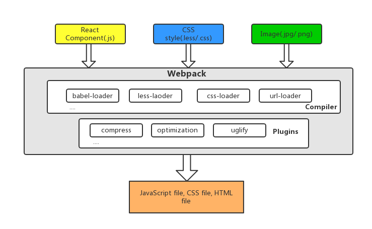

# Cloudshare Front-end Document

There is a document about front-end structure description for [Cloudshare](https://github.com/followcat/cloudshare), mainly includes folder, tools, build process etc.(2017.04.13)

---

## List of Contents

* [Build process of webpack](#build-process-of-webpack)
* [File structure](#file-structure)
* [List of tools or libraries](#list-of-tools-or-libraries)
* [How to do](#how-to-do)
* [Reference](#reference)

---

## Build process of webpack


---

## List of tools or libraries

* [react](https://github.com/facebook/react): A JavaScript library for build UI.
* [ant-design](https://github.com/ant-design/ant-design): A react components library of ant-design.
* [react-router](https://github.com/ReactTraining/react-router): React router solutions.
* [webpack](https://github.com/webpack/webpack): A tool for bundle JavaScript, packing modules etc.
* [babel](https://github.com/babel/babel): JavaScript compiler.
* [less](https://github.com/less/less.js): CSS dynamic language.
* [echarts](https://github.com/ecomfe/echarts): Baidu visualization library.
* [eslint](https://github.com/eslint/eslint): A tool for identifying and reporting on patterns found in ECMAScript/JavaScript code.

### webpack plugins

* [webpack-dev-server](https://github.com/webpack/webpack-dev-server): A node server that provides live reloading on development.
* [extract-text-webpack-plugin](https://github.com/webpack-contrib/extract-text-webpack-plugin): Extract css text from bundle into file.
* [html-webpack-plugin](https://github.com/jantimon/html-webpack-plugin): Create HTML files.
* HotModuleReplacementPlugin: A plugin about exchanges, adds, or removes modules while an application is running without a page reload.

---


## File structure

* app/
  * build/ (file saves after builded)
  * src/ (developing files)
    * components/ (common components)
      * SomeComponent/ (SomeComponent component module)
        * style/ (CSS style folder)
          * index.less (less style)
        * SomeComponent.js (SomeComponent component)
        * index.js (export SomeComponent component)
    * config/ (config file, such as api, url)
    * image/
    * request/ (all of fetch function modules)
    * routes/ (front-end router modules)
    * utils/ (function of tools)
    * views/ (front-end view modules)
    * index.js (entry file)
    * template.html (html template)
  * .babelrc (babel option)
  * .eslintrc (eslint option)
  * cloudshare-theme-default.js ([replace ant design default theme](https://github.com/ant-design/antd-init/blob/master/examples/customize-antd-theme/theme.js))
  * config.js (constant for webpack)
  * package.json (front-end project description and packages manage file)
  * postcss.config.js (postcss required)
  * webpack-dev-config.js (webpack config on development environment)
  * webpack-prod-config.js (webpack config on production environment)
  * webpack.config.js (webpack base config)

---

## How to do

1. Install  
  On `app` folder, run ```npm install```

2. Start server on developing environment  
  ```
  cd app/
  npm run dev
  ```

3. Build  
  ```
  cd app/
  npm run build:production
  ```
  or  
  ```
  cd webapp/
  sh ./build.sh
  ```

---

## Reference

You can find the offical document of packages through use [Google](https://www.google.com), and there are some blogs reference below content:

* [Configuring React](http://survivejs.com/webpack/advanced-techniques/configuring-react/)
* [Using Webpack's Hot Module Replacement with React](http://matthewlehner.net/react-hot-module-replacement-with-webpack/)
* [React-Redux-Flask](https://github.com/dternyak/React-Redux-Flask)
* [Webpack | React 入门教程 - GitBook](https://hulufei.gitbooks.io/react-tutorial/content/webpack.html)
* [Webpack Tutorials](http://webpack.github.io/docs/tutorials/getting-started/)
